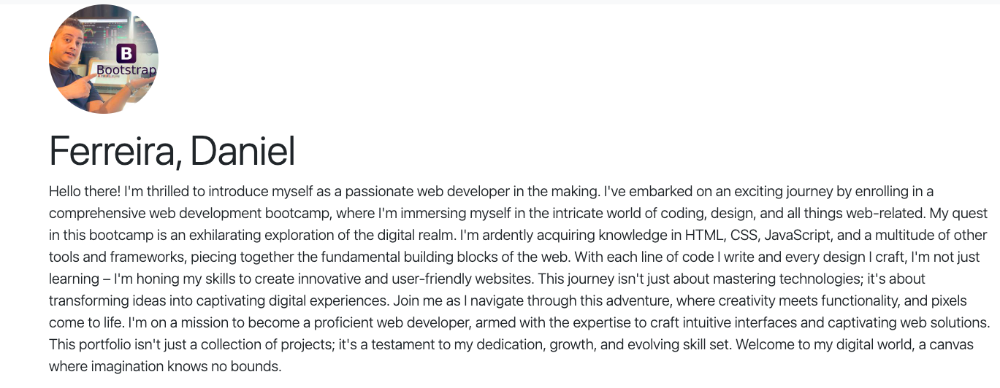
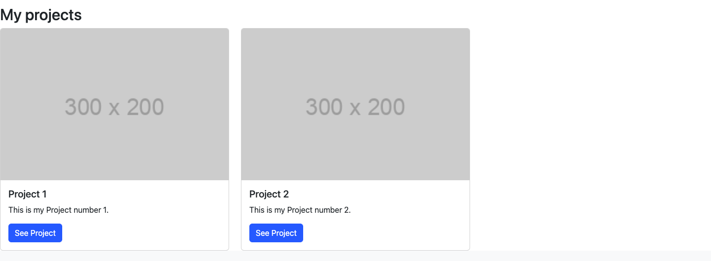
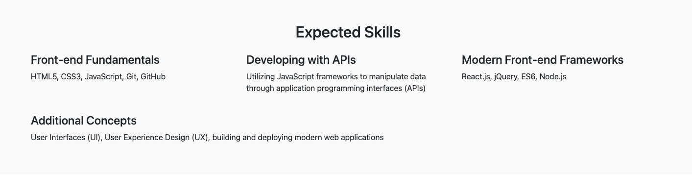
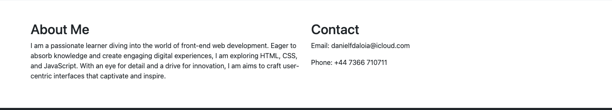

# Bootstrap-Portfolio

## Description

This project showcases a portfolio website built using Bootstrap, HTML, CSS, and JavaScript. It includes sections such as a navbar, hero section with a jumbotron, project showcase, expected skills, about me, contact details, and a footer.

## Screenshots

### Navbar 


### Hero Section


### Projects Showcase


### Skills Section


### About Me and Contact Section


### Footer Section


## Installation

To view this project locally:

1. Clone this repository.
   ```bash
   git clone gh repo clone danielfdaloia/Bootstrap-Portfolio

   Open the index.html file in a web browser.
Usage
This portfolio can be used as a template for showcasing your projects and skills. Feel free to customize it according to your preferences.

Contributing
Contributions are welcome! Fork this repository, make your changes, and submit a pull request.

License
This project is licensed under the MIT License. For more details, see the LICENSE file.

## Acknowledgements

I extend my gratitude to the instructors and the entire team at the edX bootcamp, where I've been gaining comprehensive knowledge in front-end web development. Their guidance and curriculum have equipped me with the skills necessary to utilize resources effectively, enabling me to build websites following best practices.

